<div align="center">

# Eisenflow

[](#)
[](https://nextjs.org/)
[](https://reactjs.org/)
[](https://www.typescriptlang.org/)
[](https://tailwindcss.com/)
[](https://opensource.org/licenses/MIT)

**Prioritize Smarter, Act Faster with AI.**

[Live Demo](#) · [Report Bug](#) · [Request Feature](#) · [Contribute](#)


<a href="https://peerlist.io/surydev/project/eisenflow" target="_blank" rel="noreferrer">
				
			</a>
            
---
</div>


## 📖 About Eisenflow

We all have a million things to do, but let's be real—not everything deserves our attention. The hard part? Figuring out what actually matters and what's just noise.

That's where **Eisenflow** comes in. Inspired by the Eisenhower Matrix, it helps you sort your tasks with one click, so you can stop feeling overwhelmed and start making real progress.

Instead of staring at a messy to-do list, Eisenflow helps you instantly categorize tasks into four simple buckets:

- ✅ **Do Now** – The urgent and important stuff that needs your immediate attention.
- 🔄 **Plan for Later** – Big-picture tasks that matter but don't need to be done today.
- ⚠️ **Delegate** – Things that need to get done but don't need you to do them.
- ❌ **Eliminate** – The distractions that are just wasting your time.

---

## ✨ How It Works

Eisenflow makes task management effortless:

1. **Enter your tasks** – Add everything on your plate inside the app.
2. **Click 'Ask AI'** – Eisenflow sorts each task into the right category.
3. **Get a clear action plan** – Know exactly what needs your focus, and what doesn't.

This isn't another to-do list—it's a decision-making system designed to help you focus and move faster.

---

## 🚀 Features

- 🧠 **AI-Powered Categorization** – No more overthinking. Let AI handle the sorting.
- 📊 **Eisenhower Matrix Framework** – A time-tested method for better decisions.
- ⚡ **One-Click Sorting** – Get clarity in seconds, not hours.
- 🔥 **Simple, Drag and Drop Interface** – No clutter. Just a tool that helps you get things done.
- 🐸 **Eat the Frog Mode** – Tackle your most important task first and build momentum.

---

## 👥 Who Is This For?

Eisenflow is built for:

- **Busy professionals** who need to cut through the noise.
- **Entrepreneurs & team leads** managing shifting priorities.
- **Students & freelancers** balancing deadlines and deep work.
- **Anyone tired of feeling busy but not productive.**

---

## 🎯 Quick Start

### Prerequisites

Before you begin, ensure you have:

- **Node.js** v14 or later ([Download](https://nodejs.org/))
- **npm** or **yarn** package manager
- **AI API Key** (optional for AI-powered sorting)

### Installation

```bash
# Clone the repository
git clone https://github.com/yourusername/eisenflow.git

# Navigate to project directory
cd eisenflow

# Install dependencies
npm install
# or
yarn install
```

### Environment Setup

Create a `.env.local` file in the root directory:

```env
# Optional: Your AI API key for task categorization
AI_API_KEY=your_api_key_here

# App configuration
NEXT_PUBLIC_MAX_TASKS=50
```

### Running the Application

```bash
# Start development server
npm run dev
# or
yarn dev
```

Open [http://localhost:3000](http://localhost:3000) in your browser to start using Eisenflow.

---

## 💡 The Eisenhower Matrix

```mermaid
graph TB
    A[All Tasks] --> B{Urgent?}
    B -->|Yes| C{Important?}
    B -->|No| D{Important?}
    C -->|Yes| E[✅ Do Now]
    C -->|No| F[⚠️ Delegate]
    D -->|Yes| G[🔄 Plan for Later]
    D -->|No| H[❌ Eliminate]
```



The Eisenhower Matrix is a proven time management framework that helps you prioritize by urgency and importance, not just deadlines.

---

## 🤝 Contributing

We love contributions from developers of all skill levels! DevMD is proudly participating in **Hacktoberfest 2025** 🎃

### Ways to Contribute

<table>
<tr>
<td width="25%">

**🐛 Bug Fixes**

Find and fix issues labeled [`bug`](https://github.com/suryanshsingh2001/eisenflow-ai/labels/bug)

</td>
<td width="25%">

**✨ New Features**

Build features labeled [`enhancement`](https://github.com/suryanshsingh2001/eisenflow-ai/labels/enhancement)

</td>
<td width="25%">

**📚 Documentation**

Improve docs labeled [`documentation`](https://github.com/suryanshsingh2001/eisenflow-ai/labels/documentation)

</td>
<td width="25%">

**🎨 UI/UX**

Enhance design labeled [`ui/ux`](https://github.com/suryanshsingh2001/eisenflow-ai/labels/ui)

</td>
</tr>
</table>

### Getting Started

```bash
# 1. Fork the repository on GitHub

# 2. Clone your fork
git clone https://github.com/YOUR_USERNAME/eisenflow.git

# 3. Create a feature branch
git checkout -b feature/amazing-feature

# 4. Make your changes and commit
git commit -m "feat: add amazing feature"

# 5. Push to your fork
git push origin feature/amazing-feature

# 6. Open a Pull Request
```

---

## ❓ FAQ

<details>
<summary><strong>How does AI categorization work?</strong></summary>
<br>
Eisenflow uses AI to analyze your task descriptions and automatically sort them into the appropriate Eisenhower Matrix quadrant based on urgency and importance indicators.
</details>

<details>
<summary><strong>Can I manually move tasks between categories?</strong></summary>
<br>
Absolutely! Eisenflow provides a drag-and-drop interface so you can easily adjust AI suggestions or manually organize your tasks.
</details>

<details>
<summary><strong>Is my data stored securely?</strong></summary>
<br>
Your tasks are stored locally in your browser. We take your privacy seriously and don't send your data anywhere unless you explicitly use AI categorization features.
</details>

<details>
<summary><strong>What is "Eat the Frog Mode"?</strong></summary>
<br>
Based on the famous productivity principle, this mode highlights your most important task and encourages you to tackle it first thing, building momentum for the rest of your day.
</details>

<details>
<summary><strong>Does this work offline?</strong></summary>
<br>
Yes! Eisenflow works offline for all core features. AI categorization requires an internet connection, but manual sorting and task management work without one.
</details>

---

## 🛠️ Tech Stack

<table>
<tr>
<td align="center" width="96">

<br>Next.js
</td>
<td align="center" width="96">

<br>React
</td>
<td align="center" width="96">

<br>TypeScript
</td>
<td align="center" width="96">

<br>Tailwind
</td>
</tr>
</table>


**Additional Technologies:**
- **UI Components:** shadcn/ui
- **AI Processing:** Google Gemini Flash
- **Rate Limiting:** Arcjet
- **Icons:** Lucide React

---

## 🔮 Roadmap

### 🎯 Next Up

- [ ] Calendar integration for scheduled tasks
- [ ] Task dependencies and subtasks
- [ ] Team collaboration features
- [ ] Mobile app (iOS & Android)
- [ ] Analytics dashboard for productivity insights

### 🚀 Future Vision

- [ ] **Browser Extension** – Quick capture from anywhere
- [ ] **Pomodoro Timer Integration** – Focus sessions for "Do Now" tasks
- [ ] **Recurring Tasks** – Automate your routine
- [ ] **Export Options** – PDF, CSV, and calendar exports
- [ ] **Custom Categories** – Beyond the traditional matrix
- [ ] **Voice Input** – Add tasks hands-free

Have ideas? [Share them with us!](#)

---

## 📄 License

This project is licensed under the [MIT License](LICENSE). Feel free to use, modify, and distribute as you see fit.

---

## 📬 Connect & Support

**Maintainer:** [Suryansh Singh](https://www.linkedin.com/in/suryanshsingh2001/)

**Website:** [eisenflow.com](https://eisenflow.surydev.site/)

**Issues:** [GitHub Issues](https://github.com/suryanshsingh2001/eisenflow-ai/issues)

---

## 🙏 Acknowledgments

- Built with ❤️ using [Next.js](https://nextjs.org/) and [shadcn/ui](https://ui.shadcn.com/)
- Powered by [Google Gemini](https://deepmind.google/technologies/gemini/)
- Icons provided by [Lucide](https://lucide.dev/)
- Rate limiting by [Arcjet](https://arcjet.com/)
- Inspired by the amazing developer community
---

<div align="center">

**Made with ❤️ for people who want to do less, but achieve more**

[⬆ back to top](#eisenflow)

</div>


